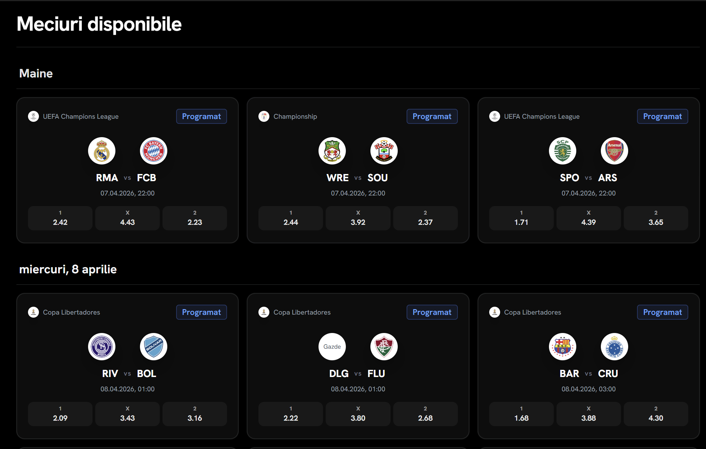
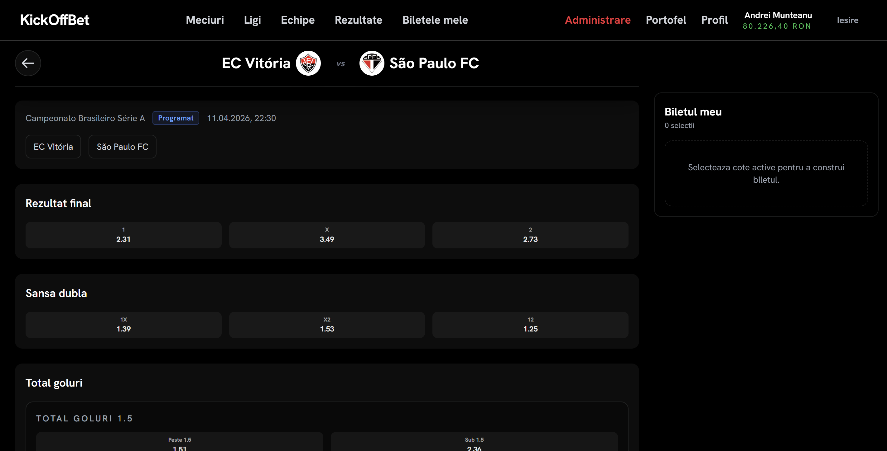
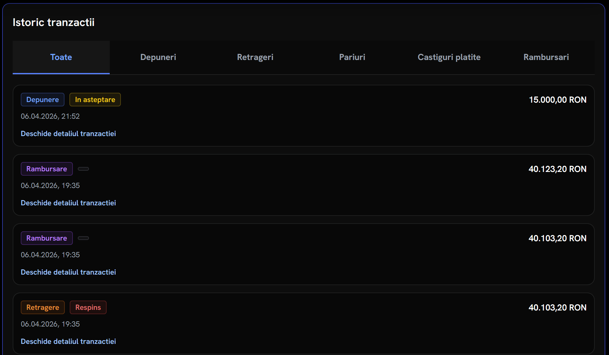
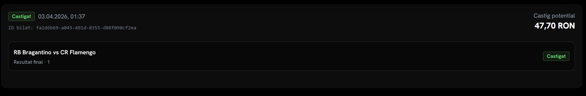
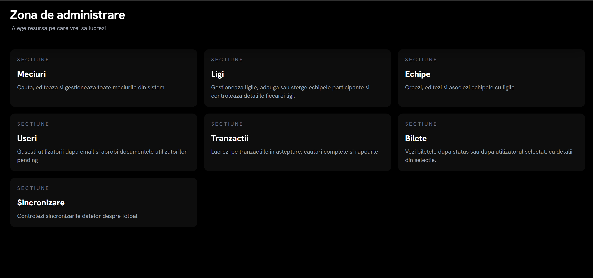
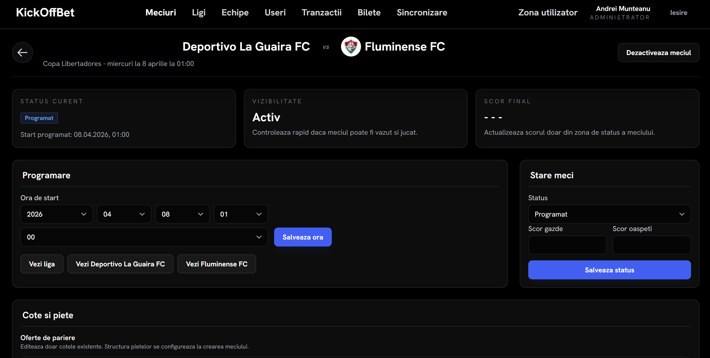
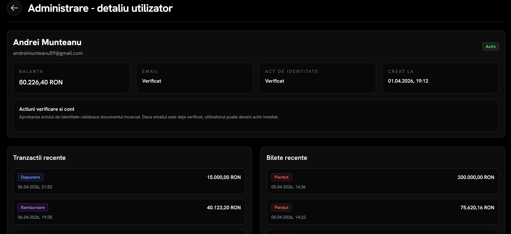
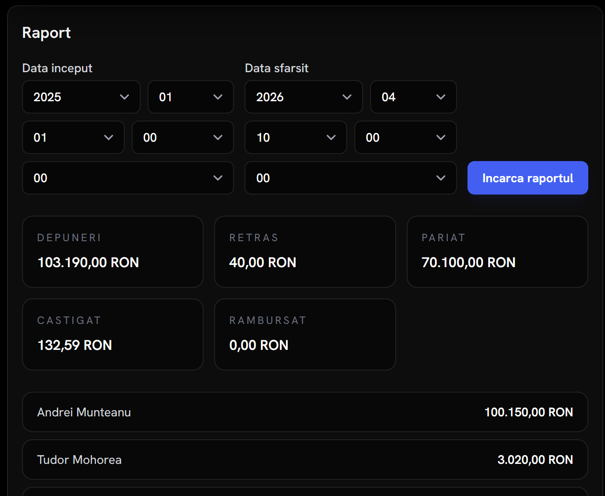

# KickOffBet

Full-stack sports betting platform — my bachelor's thesis project, designed, built and deployed end-to-end.

**Live demo:** https://kickoffbet.duckdns.org

| Role | Email | Password |
|---|---|---|
| User | usertest@kickoffbet.com | AbCd#2803 |

> Demo only — no real money. All balances and transactions are fictitious. Admin access available on request.

Backend: **Java 21 / Spring Boot** · Frontend: **Vue 3 + TypeScript** · Database: **PostgreSQL** · Deployed on **Oracle Cloud** behind **Caddy** (automatic HTTPS via Let's Encrypt).

## Screenshots

| | |
|---|---|
|  |  |
| *Match list with persistent bet slip* | *Match detail: all betting markets* |
|  |  |
| *Wallet with filterable transaction history* | *Placed ticket with per-selection status* |
|  |  |
| *Admin dashboard* | *Odds management for a match* |
|  |  |
| *User management with KYC document review* | *Aggregated financial report by period* |

## What it does

**For users**
- Registration with email confirmation, JWT login (access + refresh tokens), password reset
- KYC: identity document upload, reviewed and approved by an admin before the account is activated
- Browsing matches by league or team, with live-updating odds across four market types (1X2, double chance, over/under, both teams to score)
- Persistent bet slip: build a ticket across multiple matches, see total odds and potential winnings in real time
- Virtual wallet: deposits, withdrawals, full filterable transaction history

**For admins**
- Seven management areas: matches, leagues, teams, users, transactions, tickets, data sync
- Match creation with configurable initial markets; manual odds edits are protected from being overwritten by the automatic engine
- KYC review with in-page document preview; account approval, suspension and reactivation
- AML approval queue for flagged transactions; financial reports aggregated by period, top depositors, per-user summaries
- One-click synchronization of real fixtures from the Football Data API

## Technical highlights

- **Statistical odds engine** — odds are generated from a Poisson model whose parameters are derived from historical team metrics, aggregated in a PostgreSQL materialized view; recalculation is triggered by asynchronous Spring events so it never blocks the request flow
- **AML transaction monitoring** — configurable rules (wagering requirement, monthly withdrawal cap, velocity threshold); flagged operations are held as PENDING for manual admin approval, with automatic refund on rejection
- **Financial integrity** — every wallet operation is ACID-transactional, and balance updates use optimistic locking so concurrent operations cannot corrupt user funds
- **Security** — stateless JWT with refresh tokens, temporary account lockout after repeated failed logins, per-endpoint rate limiting with Bucket4j, and KYC documents that are streamed exclusively through the backend (never publicly reachable via object storage)
- **Automatic settlement** — when results are recorded, tickets are evaluated, winnings credited (with payout capping) and stakes refunded for cancelled matches, all without manual intervention

## Tech stack

**Backend:** Java 21, Spring Boot, Spring Security, Spring Data JPA, PostgreSQL, MinIO, MapStruct, Bucket4j, Spring Mail, Springdoc OpenAPI

**Frontend:** Vue 3, TypeScript, Vite, Vue Router, Pinia, TanStack Query, Axios, VeeValidate + Zod, Tailwind CSS 4

**Infrastructure:** Docker Compose, Caddy (automatic HTTPS), Nginx, MinIO, Adminer; production on Oracle Cloud

## Architecture in one paragraph

A Vue 3 SPA talks to a layered Spring Boot REST API (controllers → services → repositories → domain), documented with OpenAPI. Cross-cutting concerns live in dedicated packages: security (JWT filters, endpoint rules), events/listeners (async odds recalculation, settlement triggers), centralized exception handling. In production, Caddy terminates TLS on a single domain and routes `/api/*` to the backend, public assets (team/league logos) to MinIO, and everything else to the SPA.

## Running it locally

Requirements: Java 21, Node.js 20+, Docker with Docker Compose.

```bash
git clone https://github.com/Munte2803/KickOffBet-licenta.git
cd KickOffBet-licenta
cp .env.example .env   # fill in the required variables
docker compose up -d --build
```

The app starts with PostgreSQL, MinIO and Adminer alongside the backend and frontend. See `.env.example` for every variable, including the production-only ones (domain, ACME email, proxy settings) used by `docker-compose.prod.yml`.

## Production deployment

The production overlay (`docker-compose.prod.yml`) adds Caddy as the single public entry point: it obtains and renews the Let's Encrypt certificate automatically and reverse-proxies the API, the SPA and the public asset bucket on one domain. The live instance runs on an Oracle Cloud VM.

---

*Built as my bachelor's thesis at the Romanian-American University, Faculty of Managerial Informatics (2026).*
